# Parcial 2

Este fue el paso a paso que seguí para construir y probar el proyecto. La idea fue dejar una API en TypeScript conectada a MySQL, con modelos, rutas, archivos de prueba y datos falsos para verificar que todo funcionara correctamente.

## 1. Configuración inicial

Primero configuré TypeScript con el archivo `tsconfig.json`. Allí quedó definido que el código fuente está en `src` y que la compilación sale hacia `dist`.

<p>
  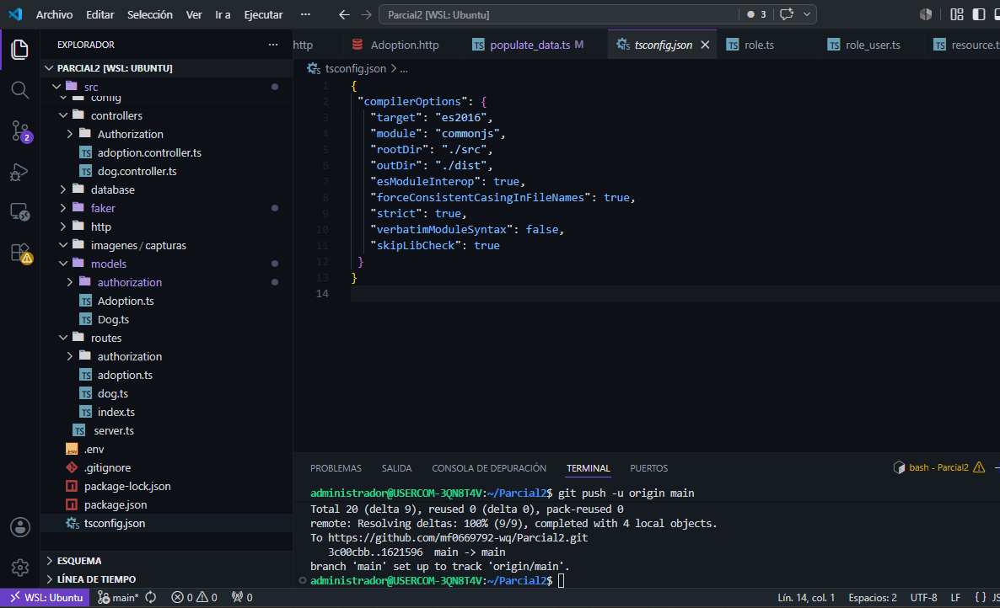
</p>

También preparé el archivo `.env`, donde dejé las variables de conexión para no escribir directamente los datos de la base de datos dentro del código.

<p>
  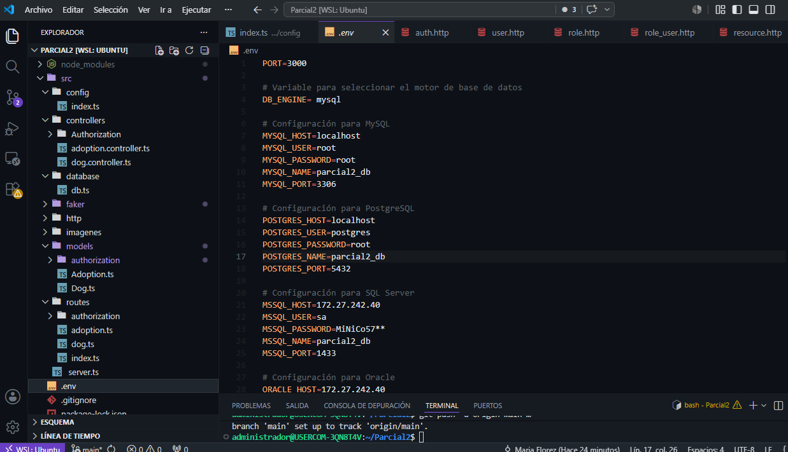
</p>

## 2. Conexión con MySQL

Después creé la configuración de la base de datos en `src/database/db.ts`. En este archivo se define el motor de base de datos, las credenciales que vienen desde `.env` y la conexión con Sequelize.

<p>
  
</p>

Luego verifiqué que la base de datos existiera en MySQL y que el proyecto pudiera conectarse correctamente.

<p>
  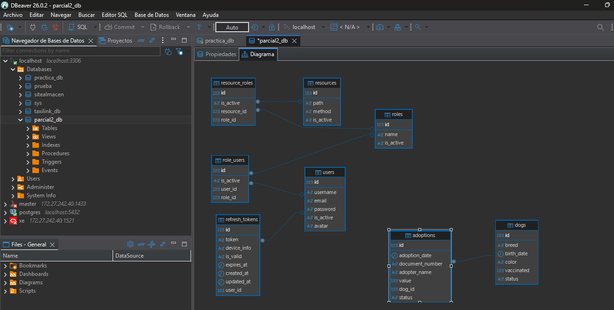
</p>

## 3. Configuración del servidor

Luego organicé la configuración principal de Express. Se agregaron middlewares como `morgan`, `cors`, `express.json()` y la sincronización con Sequelize.

<p>
  
</p>

También dejé listo el archivo del servidor para iniciar la aplicación y escuchar el puerto configurado.

<p>
  
</p>

## 4. Modelos principales

Después creé los modelos `Dog` y `Adoption`. El modelo de perros guarda la raza, fecha de nacimiento, color, vacunación y estado. El modelo de adopciones guarda la fecha, documento, nombre del adoptante, valor y el perro asociado.

En este paso se pidió ayuda a la IA para organizar mejor la estructura de los modelos y corregir detalles de TypeScript.

<p>
  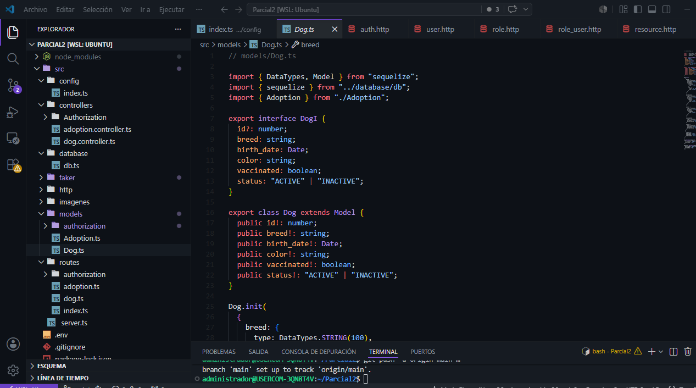
</p>

<p>
  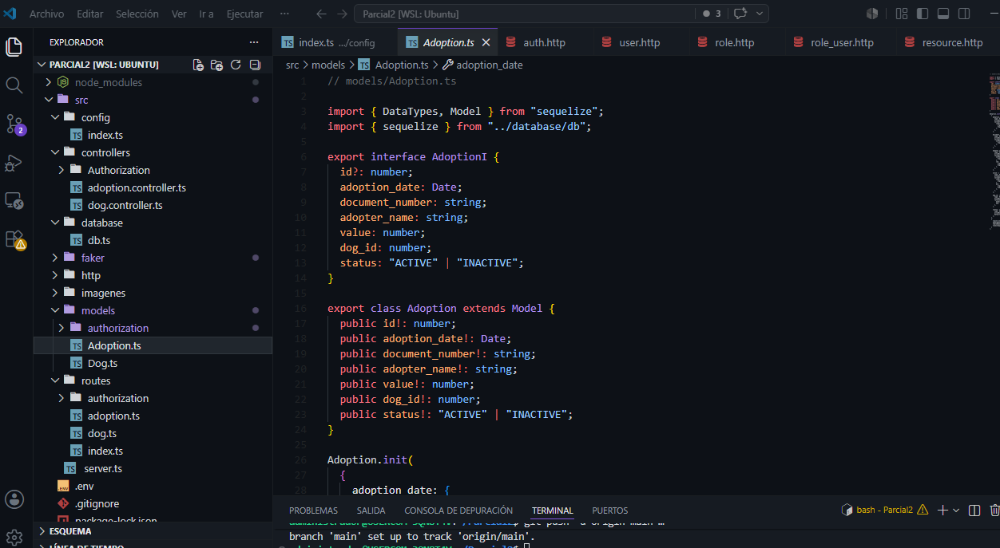
</p>

## 5. Rutas del proyecto

Con los modelos listos, creé las rutas para perros y adopciones. Estas rutas permiten listar, consultar, crear, actualizar y eliminar registros.

En este paso también se pidió ayuda a la IA para corregir errores de importación y dejar las rutas funcionando.

<p>
  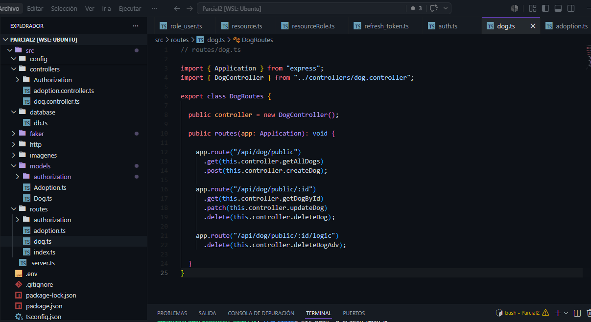
</p>

<p>
  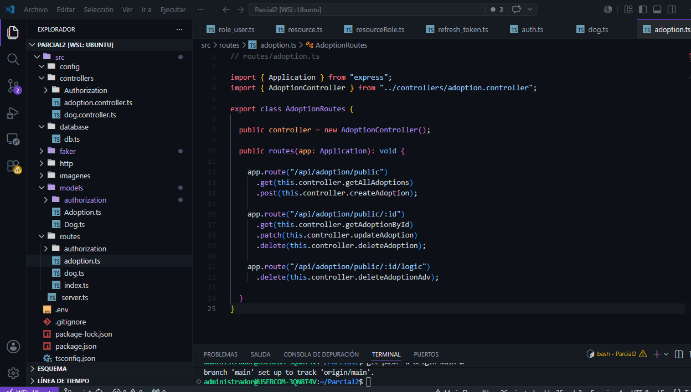
</p>

También se creó el archivo `index.ts` de rutas para centralizar la organización del proyecto.

<p>
  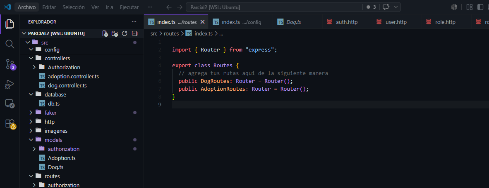
</p>

## 6. Pruebas HTTP

Para probar la API creé archivos `.http`. Con ellos pude ejecutar las peticiones directamente desde el editor y comprobar los endpoints de perros y adopciones.

<p>
  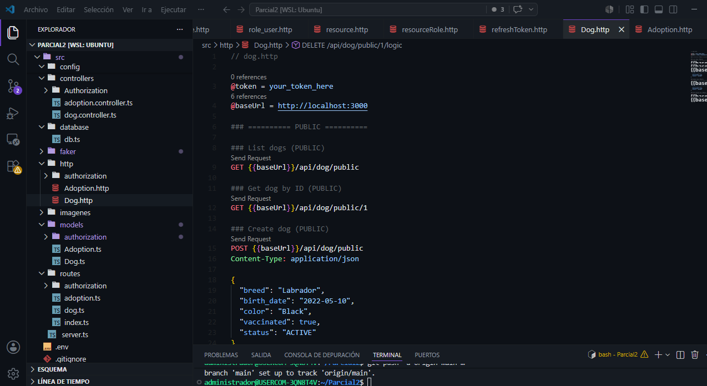
</p>

<p>
  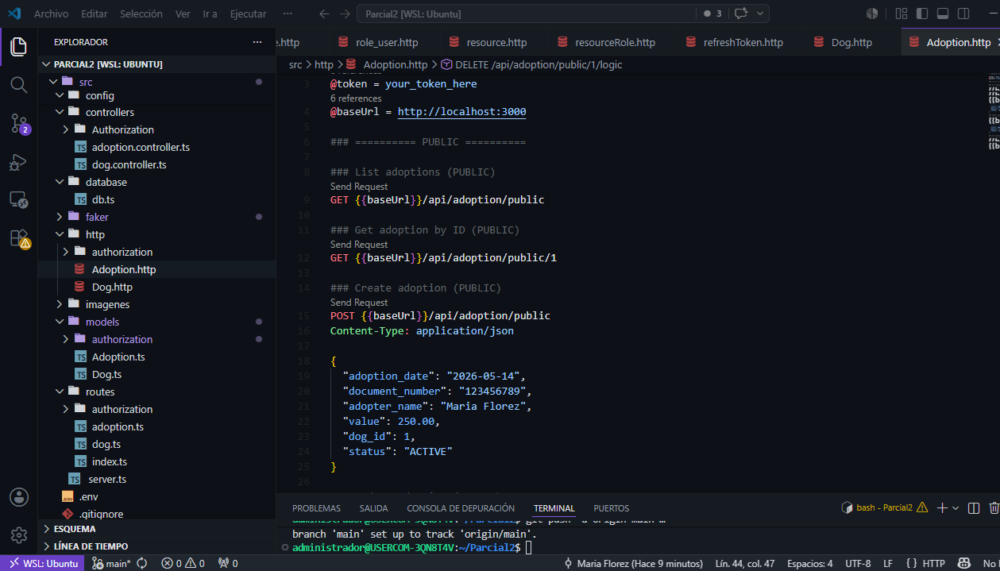
</p>

## 7. Datos falsos con Faker

Finalmente creé el archivo `src/faker/populate_data.ts` para insertar datos falsos en la base de datos. El script genera usuarios, roles, recursos, perros, adopciones y sus relaciones.

El comando usado para ejecutarlo fue:

```bash
npx ts-node src/faker/populate_data.ts
```

<p>
  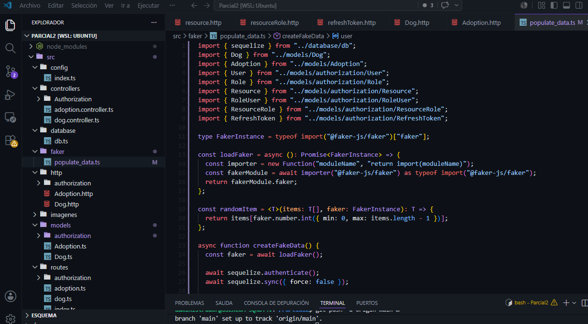
</p>

Al ejecutarlo, los datos quedaron registrados en MySQL y se pudo confirmar que la base de datos estaba recibiendo la información correctamente.

<p>
  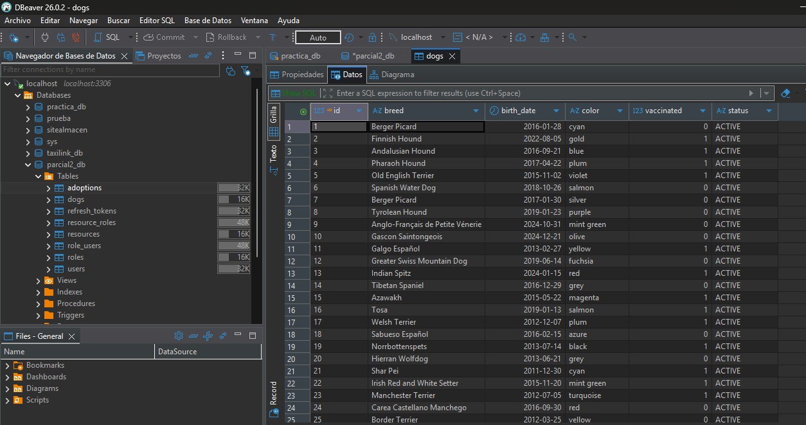
</p>

## Resultado final

Al final quedó una API funcional, conectada a MySQL, con modelos relacionados, rutas organizadas, pruebas HTTP y un script para poblar la base de datos. Esto permitió probar el proyecto de forma más rápida y sin tener que insertar cada registro manualmente.

